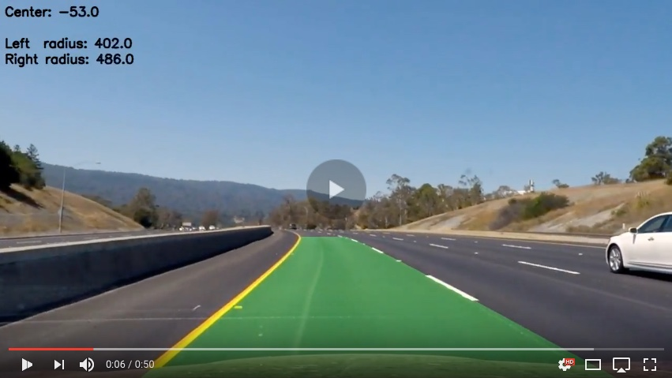

## Advanced Lane Finding Project ## 
The Goal of this Project is to write a software pipeline to identify the lane boundaries in a video from a front-facing camera on a car. The camera calibration images, test road images, and project videos are available in the project repository.
---

Project steps:

* Compute the camera calibration matrix and distortion coefficients given a set of chessboard images.
* Apply a distortion correction to raw images.
* Use color transforms, gradients, etc., to create a thresholded binary image.
* Apply a perspective transform to rectify binary image ("birds-eye view").
* Detect lane pixels and fit to find the lane boundary.
* Determine the curvature of the lane and vehicle position with respect to center.
* Warp the detected lane boundaries back onto the original image.
* Output visual display of the lane boundaries and numerical estimation of lane curvature and vehicle position.

[//]: # (Image References)

[image1]: ./examples/undistort_output.png "Undistorted"
[image2]: ./examples/undistort_example.png "Road Transformed"
[image3]: ./examples/binary_example_1.png "Binary Example1"
[image7]: ./examples/binary_example_2.png "Binary Example2"
[image8]: ./examples/binary_example_3.png "Binary Example3"
[image4]: ./examples/pers_trans.png "Warp Example"
[image9]: ./examples/pers_trans2.png "Warp Example"
[image5]: ./examples/poly.png "Fit Visual"
[image10]:./examples/poly1.png "Fit Visual"
[image11]:./examples/poly2.png "Fit Visual"
[image6]: ./examples/lines.png "Output"
[image77]: ./img/dist.png "Distortion"
[video1]: ./project_video_out.mp4 "Video"

### Camera Calibration

#### Extraction of object points and image points for camera calibration with OpenCV
Real cameras use curved lenses to form an image, and light rays often bend a little too much or too little at the edges of these lenses. This creates an effect that distorts the edges of images, so that lines or objects appear more or less curved than they actually are. This is called radial distortion, and it’s the most common type of distortion.
Another type of distortion, is tangential distortion. This occurs when a camera’s lens is not aligned perfectly parallel to the imaging plane, where the camera film or sensor is. This makes an image look tilted so that some objects appear farther away or closer than they actually are.
There are three coefficients needed to correct for radial distortion: `k1`, `k2`, and `k3`. To correct the appearance of radially distorted points in an image, one can use a correction formula. To undistort image, `OpenCV` calculates `r`, which is the known distance between a point in an undistorted (corrected) image and the center of the image distortion, which is often the center of that image. This center point is sometimes referred to as the distortion center. These points are pictured below.
![alt text][image77]
I used the OpenCV functions `findChessboardCorners()` and `drawChessboardCorners()` to automatically find and draw corners in an image of a chessboard pattern.

#### Camera matrix and distortion coefficients calculation.

The code for this step is contained in the `first and third code cells` of the [`IPython notebook`](./Advanced-Lane-Lines-3.ipynb) (or in `lines 18 through 90` in [`python script`](./Advanced-Lane-Lines-Copy2.py) ).  

I start by preparing "object points", which will be the `(x, y, z)` coordinates of the chessboard corners in the world. Here I am assuming the chessboard is fixed on the `(x, y)` plane at `z=0`, such that the object points are the same for each calibration image.  Thus, `objp` is just a replicated array of coordinates, and `objpoints` will be appended with a copy of it every time I successfully detect all chessboard corners in a test image.  `imgpoints` will be appended with the `(x, y)` pixel position of each of the corners in the image plane with each successful chessboard detection.  

I then used the output `objpoints` and `imgpoints` to compute the camera calibration and distortion coefficients using the `cv2.calibrateCamera()` function.  I applied this distortion correction to the test image using the `cv2.undistort()` function and obtained this result: 

![alt text][image1]

### Pipeline (single images)

#### Distortion-corrected.

The demonstration of distortion correction to one of the test images:
![alt text][image2]

#### Image preprocessing: color transforms, gradients or other methods to create a thresholded binary image.

I used different combination of color and gradient thresholds to generate a binary image. The code for this step is contained in the `fourth and ninth code cells` of the [`IPython notebook`](./Advanced-Lane-Lines-3.ipynb) (or in `lines 90 through 315` of [`python script`](./Advanced-Lane-Lines-Copy2.py) ).  Here's an example of my output for this step.

![alt text][image3]
![alt text][image7]

Final version of binarization: Sobel gradint on x coordinat, L and S channels of HLS layers of image representation, White/Yellow color filters and determination of the region of interest (without the car).

![alt text][image8]

#### 3. Perspective transformation.

The code for my perspective transform includes a function called `PerspTranform_()`, which appears in `lines 345 through 400` of [`python script`](./Advanced-Lane-Lines-Copy2.py) (or, for example, in the `11th and 12th code cells` of [`IPython notebook`](./Advanced-Lane-Lines-3.ipynb) ).  The `PerspTranform_()` function takes as inputs an image (`img`).  I chose the source and destination points taking into account the image where the lines ase supposed to parallel and choose 4 dots on it.

This resulted in the following source and destination points:
     

| Source        | Destination   | 
|:-------------:|:-------------:| 
| 595, 450      | 300, 0        | 
| 200, 720      | 300, 720      |
| 1100, 720     | 980, 720      |
| 685, 450      | 980, 0        |

I verified that my perspective transform was working as expected by drawing the `src` and `dst` points onto a test image and its warped counterpart to verify that the lines appear parallel in the warped image.

![alt text][image4]
![alt text][image9]

#### 4. Lane-line pixels identification.

Then I did some other stuff and fit my lane lines with a `2nd order polynomial`. The code for this step is contained between `13th and 18th code cells` of the [`IPython notebook`](./Advanced-Lane-Lines-3.ipynb) (or in `lines 400 through 600` of [`python script`](./Advanced-Lane-Lines-Copy2.py) ). The main function here is `find_window_centroids()` Here's an examples of my output for this step. 

![alt text][image5]
![alt text][image10]
![alt text][image11]

#### Radius of lane curvature and the position of the vehicle with respect to center.

The code for this step is contained between `19th and 20th code cells` of the [`IPython notebook`](./Advanced-Lane-Lines-3.ipynb) (or in `lines 600 through 630` of [`python script`](./Advanced-Lane-Lines-Copy2.py) ).

#### 6. An example image of your result plotted back down onto the road.

The code for this step is contained in `21 code cell` of the [`IPython notebook`](./Advanced-Lane-Lines-3.ipynb) (or in `lines 630 through 660` of [`python script`](./Advanced-Lane-Lines-Copy2.py) ). Here is an example of my result on a test image:

![alt text][image6]

---

### Pipeline (video)

#### Final video output. The pipeline performs reasonably well on the entire project video.

Here's a [link to my video result](./project_video_out.mp4)

You can see the final vidoe output on Youtube: 

The original video can be downloaded [here](./project_video_out.mp4)

---

#### Problems / issues I faced.

 Pipeline perform reasonably well, but there are several cases when it behave not as well as I expected:
 * Bright regions
 * Other cars driving near the lines
 I tried to improve this by color filters (yellow and white) but it is not enough.
